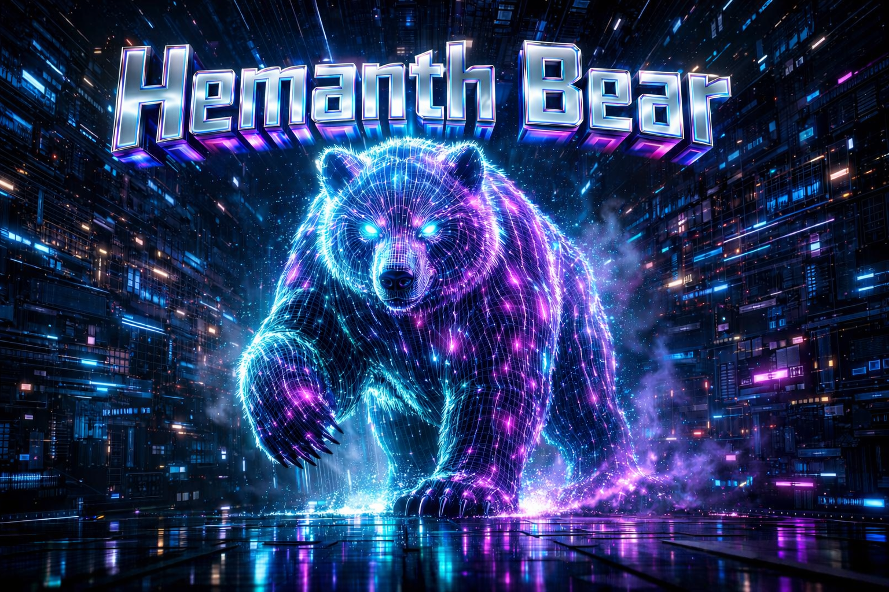

  
  
   
  
  

<!-- Trophy Service Currently Down (503)

  

-->

## 👨‍💻 About Me

I am a **Lead Full-Stack Architect** and **AI Researcher** bridging the gap between **academic theory** and **enterprise production**.  
I specialize in **Multimodal AI** and **Agentic Architectures**, designing autonomous systems that integrate complex data streams to solve high-dimensionality problems.

- 🔭 **Currently working on:**
<!-- CURRENT-WORK-START -->
  
<!-- CURRENT-WORK-END -->
- 💬 **Ask me about:** Java, Deep Learning, Medical AI, and Automated Workflows
- ⚡ **Fun fact:** I can code a Thesis Auditor while simultaneously debugging a Spring Boot server

## 🛠️ The Arsenal (Tech Stack)

| **Languages** | **Frontend** | **AI & GenAI** | **DevOps & Tools** |
| :---: | :---: | :---: | :---: |
|  |  |  |  |
|  |  |  |  |
|  |  |  |  |
|  |  |  |  |

## 📊 GitHub Stats & Dynamics

  
  
  

 

  

  

 

## 🏆 Featured Projects 

<!-- PROJECTS-START -->
| Project | Description | Tech |
|--------|-------------|------|
| **HemanthBear99** | I am a **Lead Full-Stack Architect** and **AI Researcher** bridging the gap betw... | — |
| **Rocket** | # RLV Phase-I Ascent Simulation... | Python |
| **cs-flow** | A full-stack, production-ready workflow and task management platform for teams w... | JavaScript |
<!-- PROJECTS-END -->

## 📈 Latest Activity

<!-- ACTIVITY-START -->
- 🔨 Pushed to **HemanthBear99**: "Pushed code"
- 🔨 Pushed to **HemanthBear99**: "Pushed code"
- 🔨 Pushed to **HemanthBear99**: "Pushed code"
- 🔨 Pushed to **HemanthBear99**: "Pushed code"
- 🔨 Pushed to **HemanthBear99**: "Pushed code"
<!-- ACTIVITY-END -->

## 🤝 Connect with Me

